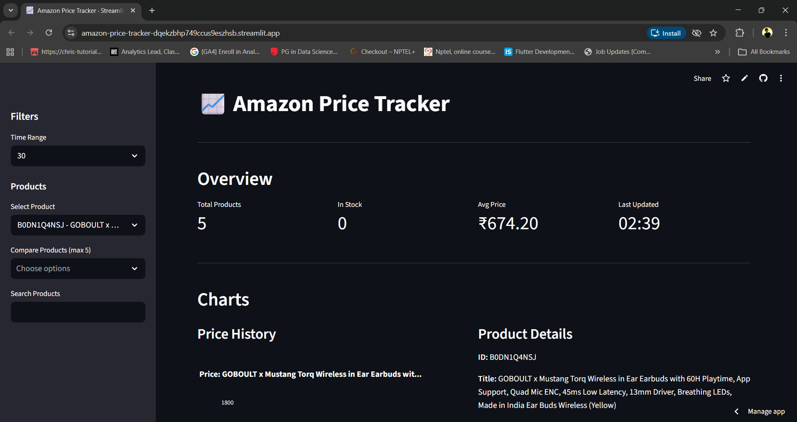

#  Amazon Price Tracker

[](LICENSE)
[](https://www.python.org/)
[]()
[]()
[]()
[]()
[]()


A production-grade price tracking system for Amazon India with automated scraping, ETL pipeline, DuckDB analytics, and interactive Streamlit dashboard.

[](https://amazon-price-tracker-dqekzbhp749ccus9eszhsb.streamlit.app/)



##  Features

- **Automated Scraping**: Intelligent HTML parsing with anti-bot headers and retry logic
- **ETL Pipeline**: Extract-Transform-Load with data quality checks
- **DuckDB Analytics**: Fast columnar database with optimized queries
- **Interactive Dashboard**: Real-time visualizations with Streamlit and Plotly
- **Price History**: Track price changes over time with alerts
- **Data Quality**: Built-in validation and quality checks
- **Production Ready**: Logging, error handling, and pipeline state tracking

##  Architecture

The system follows a **4-layer ETL architecture**:

```
┌──────────────────────────────────────────────────────────┐
│  ORCHESTRATION: GitHub Actions / Cron                    │
│  Triggers: python -m pipeline.pipeline_runner            │
└────────────────────┬─────────────────────────────────────┘
                     │
                     ▼
┌──────────────────────────────────────────────────────────┐
│  INGESTION LAYER                                          │
│  • amazon_scraper.py  - HTTP requests & bot evasion      │
│  • parser.py          - HTML parsing & extraction        │
│  • validator.py       - Data validation                  │
│  • header.py          - User-agent rotation              │
└────────────────────┬─────────────────────────────────────┘
                     │
                     ▼
┌──────────────────────────────────────────────────────────┐
│  ETL PIPELINE (pipeline_runner.py)                       │
│  ┌────────────┐  ┌──────────┐  ┌──────┐  ┌──────────┐  │
│  │  Extract   │→ │Transform │→ │ Load │→ │ Quality  │  │
│  │ (extract.py│  │(transform│  │(load_│  │ (quality_│  │
│  │            │  │     .py) │  │  raw)│  │  checks) │  │
│  └────────────┘  └──────────┘  └──────┘  └──────────┘  │
└────────────────────┬─────────────────────────────────────┘
                     │
                     ▼
┌──────────────────────────────────────────────────────────┐
│  STORAGE LAYER (DuckDB)                                  │
│  • raw_scrapes       - Raw JSON data                     │
│  • products          - Current product state             │
│  • price_history     - Time-series pricing data          │
│  • daily_price_summary - Aggregated analytics           │
│  • pipeline_state    - Orchestration tracking            │
└────────────────────┬─────────────────────────────────────┘
                     │
                     ▼
┌──────────────────────────────────────────────────────────┐
│  PRESENTATION LAYER (Streamlit Dashboard)                │
│  • app.py      - Main dashboard UI                       │
│  • queries.py  - SQL query layer                         │
│  • charts.py   - Plotly visualizations                   │
│  • filters.py  - Interactive filters                     │
└──────────────────────────────────────────────────────────┘
```

See [Architecture Documentation](docs/architecture.md) for detailed system design.

##  Project Structure

```
Amazon-Price-Tracker/
├── ingestion/                   # Data collection layer
│   ├── amazon_scraper.py       # HTTP scraper with retry logic
│   ├── parser.py               # BeautifulSoup HTML parser
│   ├── validator.py            # Data validation rules
│   └── header.py               # Anti-bot header management
│
├── pipeline/                    # ETL pipeline
│   ├── pipeline_runner.py      # Main orchestrator (ENTRY POINT)
│   ├── extract.py              # Extract from files or live scraping
│   ├── transform.py            # Clean and normalize data
│   ├── load_raw.py             # Load to DuckDB tables
│   └── quality_checks.py       # Data quality validation
│
├── storage/                     # Database layer
│   ├── duckdb_setup.py         # Connection and utilities
│   ├── queries.py              # Common SQL queries
│   └── schemas/
│       ├── init.sql            # Core tables
│       ├── views.sql           # Analytics views
│       └── indexes.sql         # Performance indexes
│
├── dashboard/                   # Streamlit UI
│   ├── app.py                  # Main dashboard (ENTRY POINT)
│   ├── dashboard_config.yaml   # UI configuration
│   ├── queries.py              # Dashboard-specific queries
│   ├── components/
│   │   ├── charts.py           # Plotly chart functions
│   │   └── filters.py          # Streamlit filter widgets
│   └── assets/                 # Static files
│
├── configs/                     # Configuration files
│   ├── dev.yaml                # Development config
│   ├── prod.yaml               # Production config
│   └── products.yaml           # Product list (ASINs)
│
├── .github/
│   └── workflows/
│       └── daily_pipeline.yml  # GitHub Actions orchestration
│
├── data/                        # Data directory (gitignored)
│   ├── amazon_prices.duckdb    # Main database
│   ├── scraper_output.json     # Intermediate data
│   └── logs/                   # Pipeline logs
│
├── docs/                        # Documentation
│   ├── architecture.md         # System architecture
│   ├── database_schema.md      # Database documentation
│   ├── pipeline_guide.md       # ETL pipeline guide
│   └── deployment.md           # Deployment instructions
│
├── requirements.txt             # Python dependencies
├── setup.py                     # Package installation
└── README.md                    # This file
```

##  Quick Start

### Prerequisites

- Python 3.10+
- 500MB disk space
- Internet connection

### Installation

```bash
# Clone repository
git clone https://github.com/Ayush-srivastava504/Amazon-Price-Tracker.git
cd Amazon-Price-Tracker

# Create virtual environment
python3 -m venv venv
source venv/bin/activate  # Windows: venv\Scripts\activate

# Install dependencies
pip install -r requirements.txt
```

### Running the Pipeline

```bash
# Run full ETL pipeline
python -m pipeline.pipeline_runner

# Run with specific products
python -m pipeline.pipeline_runner --products B08N5WRWNW,B09G9FPHY6

# Run with live scraping (bypasses file storage)
python -m pipeline.pipeline_runner --live --products B08N5WRWNW

# Run scraper only (legacy mode)
python ingestion/run_scraper.py --asins B08N5WRWNW,B09G9FPHY6
```

### Launching the Dashboard

```bash
# Start Streamlit dashboard
streamlit run dashboard/app.py

# Dashboard will open at http://localhost:8501
```

## Dashboard Features

### Overview Metrics
- Total products tracked
- In-stock count
- Average current price
- Last update timestamp

### Visualizations
- **Price History Chart**: Line chart showing price trends
- **Price Comparison**: Multi-product comparison
- **Availability Pie Chart**: Stock status distribution
- **Price Distribution**: Histogram of current prices

### Interactive Filters
- Date range selection (7, 30, 90, 180 days)
- Product search
- Product comparison (up to 5 products)
- Availability filters

### Data Export
- Export to CSV
- Download with timestamp

##  Database Schema

### Core Tables

**products** - Current product state
```sql
CREATE TABLE products (
    product_id VARCHAR PRIMARY KEY,
    title VARCHAR,
    current_price DECIMAL(10,2),
    availability VARCHAR,
    rating DECIMAL(3,2),
    seller VARCHAR,
    last_seen_at TIMESTAMP,
    is_active BOOLEAN
);
```

**price_history** - Time-series pricing data
```sql
CREATE TABLE price_history (
    price_id UUID PRIMARY KEY,
    product_id VARCHAR,
    price DECIMAL(10,2),
    scraped_at TIMESTAMP
);
```

**raw_scrapes** - Raw data for debugging
```sql
CREATE TABLE raw_scrapes (
    scrape_id UUID PRIMARY KEY,
    product_id VARCHAR,
    scraped_data JSON,
    scraped_at TIMESTAMP,
    success BOOLEAN
);
```

##  Configuration

### Dashboard Config (`dashboard/dashboard_config.yaml`)

```yaml
ui:
  page_title: "Amazon Price Tracker"
  layout: "wide"

time_ranges:
  default: 30
  options: [7, 30, 90, 180]

limits:
  max_products_chart: 10
  max_products_table: 50
```

### Pipeline Config (`configs/prod.yaml`)

```yaml
amazon:
  base_url: "https://www.amazon.in"
  request_delay: 3.0
  max_retries: 3

storage:
  database_path: "data/amazon_prices.duckdb"
  output_dir: "./data"

products:
  asins:
    - B08N5WRWNW
    - B09G9FPHY6
```

## Automated Orchestration

### GitHub Actions

```yaml
name: Daily Amazon Price Pipeline

on:
  schedule:
    - cron: "0 3 * * *"  # Daily at 3 AM UTC
  workflow_dispatch:

jobs:
  run-pipeline:
    runs-on: ubuntu-latest
    steps:
      - uses: actions/checkout@v4
      - uses: actions/setup-python@v5
        with:
          python-version: "3.10"
      
      - name: Install dependencies
        run: pip install -r requirements.txt
      
      - name: Run ETL pipeline
        run: python -m pipeline.pipeline_runner
      
      - name: Commit updated database
        run: |
          git add data/amazon_prices.duckdb
          git commit -m "Daily price update $(date +'%Y-%m-%d')"
          git push
```

### Local Cron

```bash
# Add to crontab
0 3 * * * cd /path/to/Amazon-Price-Tracker && /path/to/venv/bin/python -m pipeline.pipeline_runner
```

## 📈 Pipeline Flow

The ETL pipeline follows these steps:

1. **Extract** (`extract.py`)
   - Read from `scraper_output.json` or live scraping
   - Add extraction timestamp
   - Return raw product data

2. **Load Raw** (`load_raw.py`)
   - Insert raw JSON into `raw_scrapes` table
   - Generate UUID for tracking
   - Log insertion status

3. **Transform** (`transform.py`)
   - Parse and clean product data
   - Normalize prices and availability
   - Validate data types

4. **Quality Checks** (`quality_checks.py`)
   - Check for missing fields
   - Detect price anomalies
   - Flag suspicious data

5. **Load Clean** (`load_raw.py`)
   - Update `products` table (upsert)
   - Insert into `price_history`
   - Update `pipeline_state`

## Data Quality

### Validation Rules

- Product ID must be valid ASIN (10 chars, alphanumeric)
- Price must be positive and < 10 million INR
- Title must be at least 3 characters
- In-stock products must have price
- Rating must be between 0-5

### Quality Checks

- Duplicate product IDs detection
- Price spike detection (>50% change)
- Missing required fields
- Suspicious price ranges

##  Querying Data

### From Dashboard

```python
from storage.queries import (
    get_active_products,
    get_product_history,
    get_price_alerts
)

# Get active products
products = get_active_products(limit=50)

# Get price history
history = get_product_history('B08N5WRWNW', days=30)

# Get price alerts
alerts = get_price_alerts(threshold_pct=10)
```

### Direct SQL

```python
import duckdb

conn = duckdb.connect('data/amazon_prices.duckdb')

# Get price trends
trends = conn.execute("""
    SELECT 
        DATE(scraped_at) as date,
        AVG(price) as avg_price
    FROM price_history
    WHERE product_id = 'B08N5WRWNW'
      AND scraped_at >= CURRENT_DATE - INTERVAL '30 days'
    GROUP BY DATE(scraped_at)
""").fetchdf()
```

##  Deployment

### Streamlit Cloud

1. Push to GitHub
2. Connect to Streamlit Cloud
3. Set main file: `dashboard/app.py`
4. Deploy

### Docker

```bash
# Build image
docker build -t amazon-tracker .

# Run pipeline
docker run -v $(pwd)/data:/app/data amazon-tracker python -m pipeline.pipeline_runner

# Run dashboard
docker run -p 8501:8501 -v $(pwd)/data:/app/data amazon-tracker streamlit run dashboard/app.py
```

##  Error Handling

The system handles various failure scenarios:

- **Network Errors**: Retry with exponential backoff
- **CAPTCHA Detection**: Stop scraping, log warning
- **Missing Data**: Continue pipeline, flag in quality checks
- **Database Lock**: Wait and retry with timeout
- **Parsing Errors**: Log error, skip product, continue


##  Testing

```bash
# Run all tests
pytest

# Run specific test module
pytest tests/test_pipeline.py

# Run with coverage
pytest --cov=pipeline --cov-report=html
```

##  Monitoring

### Pipeline Logs

```bash
# View pipeline log
tail -f data/logs/pipeline.log

# Search for errors
grep ERROR data/logs/pipeline.log
```

### Database Stats

```python
from storage.queries import get_db_stats

stats = get_db_stats()
print(f"Total products: {stats['total_products']}")
print(f"In stock: {stats['in_stock']}")
print(f"Scrapes today: {stats['scrapes_today']}")
```

## Contributing

1. Fork the repository
2. Create feature branch: `git checkout -b feature/amazing-feature`
3. Commit changes: `git commit -m 'Add amazing feature'`
4. Push to branch: `git push origin feature/amazing-feature`
5. Open Pull Request

##  License

This project is licensed under the MIT License - see [LICENSE](LICENSE) file.

##  Acknowledgments

- Amazon for product data
- Streamlit for dashboard framework
- DuckDB for analytics engine
- Plotly for visualizations

##  Contact

Project Link: [https://github.com/Ayush-srivastava504/Amazon-Price-Tracker](https://github.com/Ayush-srivastava504/Amazon-Price-Tracker)

---

**Built using Python, DuckDB, and Streamlit**
